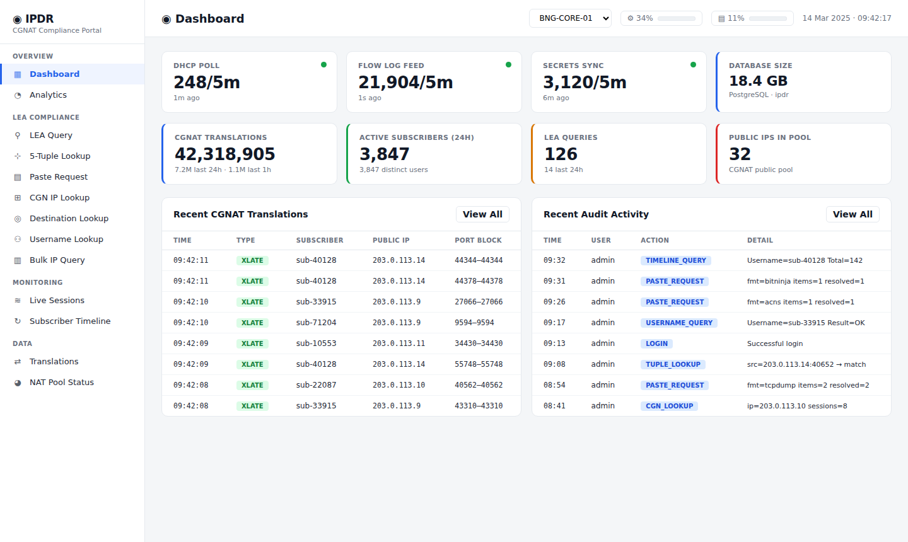
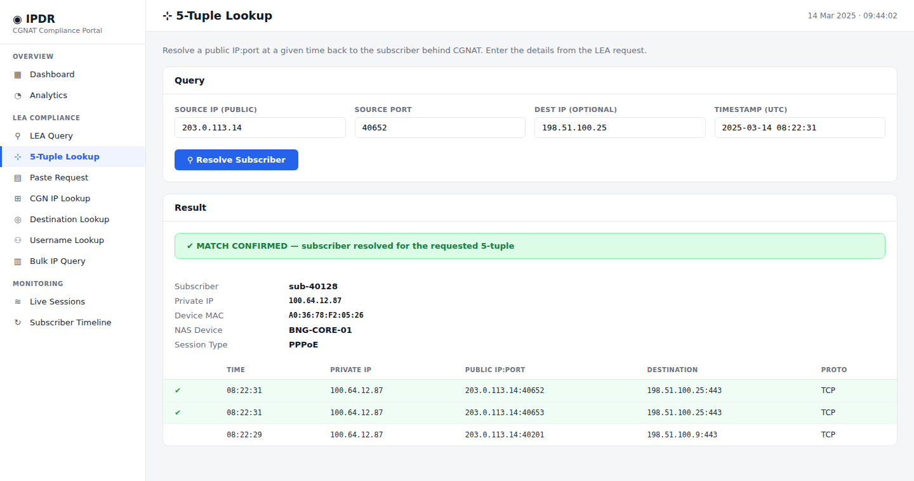
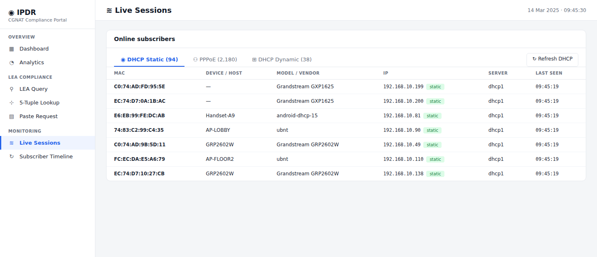

# IPDR — CGNAT Compliance & Lawful-Intercept Platform

[](https://www.gnu.org/licenses/agpl-3.0)

**Author:** Muhammad Imran Khan ([@imrankhan-coder](https://github.com/imrankhan-coder))

A self-hosted platform for ISPs to meet **CGNAT IPDR / lawful-intercept (LEA)
compliance** obligations. It ingests carrier NAT translation logs, correlates
public IP:port:time back to the subscriber behind CGNAT, and provides an audited
query interface for law-enforcement requests.

Originally built for a MikroTik RouterOS CGNAT deployment; the architecture also
supports Juniper MX PBA/flow logs.

> **Version 3.0** — DHCP lease tracking, six LEA request-parsing formats,
> background stats caching for large datasets, and vendor-aware health panels.

## What it does

- **Ingests** RouterOS firewall NAT logs (or Juniper PBA/flow logs) via syslog
- **Resolves** a public `IP:port` at a `timestamp` → the subscriber (PPPoE
  username or DHCP MAC) behind CGNAT
- **Tracks** DHCP leases MAC-anchored, with device model and IP-history, so a
  past DHCP address resolves to the device that held it at that time
- **Parses** LEA/abuse requests in multiple formats (tcpdump, ACNS XML,
  X-ARF, netflow, BitNinja, and plain `IP:port:time`)
- **Audits** every query with case-reference and reason fields
- **Scales** to millions of translations/day via time-partitioned tables and
  background-computed dashboard/analytics caches


## Screenshots

### Dashboard — pipeline health & live translation feed


### LEA 5-Tuple Lookup — resolve public IP:port:time to the subscriber


### Live Sessions — PPPoE + DHCP with MAC-anchored device tracking


> Screenshots use synthetic data. No real subscriber information is shown.

## Architecture

- **Flask** web app (Python), **PostgreSQL** (time-partitioned), **gunicorn** +
  **nginx**
- **systemd** timers for polling (PPP/DHCP), secrets sync, partition maintenance,
  and stats caches
- Per-NAS API integration with RouterOS (read-only user) for session + lease data

## Status & scope

This is provided as a **reference implementation**. It encodes one operator's
approach to a real regulatory problem. You will need to adapt it to your own
network, log formats, and legal obligations.

**This software handles subscriber PII and lawful-intercept data.** Deploy it
only if you have the legal authority to do so, and review your local regulatory
requirements. See [SECURITY.md](SECURITY.md) and [DISCLAIMER.md](DISCLAIMER.md).

## Quick start

```bash
cp .env.example .env      # then fill in real values
# create the database, run schema/ in order, configure syslog ingest,
# set up the systemd units in deploy/, then start the web service.
```

See [docs/INSTALL.md](docs/INSTALL.md) for the full setup.

## Security

- All secrets live in `.env` (gitignored). Never commit real credentials.
- Run `./scan_secrets.sh` before every commit.
- NAS API passwords are Fernet-encrypted at rest.
- The LEA API is Bearer-token protected.

## Author & Credits

Created and maintained by **Muhammad Imran Khan** ([@imrankhan-coder](https://github.com/imrankhan-coder)).

If you use, deploy, or build on this project, attribution is appreciated and — under
the AGPL — required. Please keep the copyright notice and link back to this repository.

## Acknowledgements

Built and maintained by **Muhammad Imran Khan** ([@imrankhan-coder](https://github.com/imrankhan-coder)).

Developed with the assistance of AI coding tools.

## License

Licensed under the **GNU Affero General Public License v3.0 (AGPL-3.0)** — see
[LICENSE](LICENSE) and [NOTICE](NOTICE).

The AGPL is a strong copyleft license: you may use, modify, and self-host this
software freely, but if you distribute it **or run a modified version as a network
service**, you must make your source changes available under the same license.
This keeps the shared version open for the whole operator community.

## Disclaimer

Not affiliated with MikroTik, Juniper, or any regulator. Provided as-is, without
warranty. The authors are not responsible for how you deploy or use it. Ensure
your use complies with all applicable laws.
